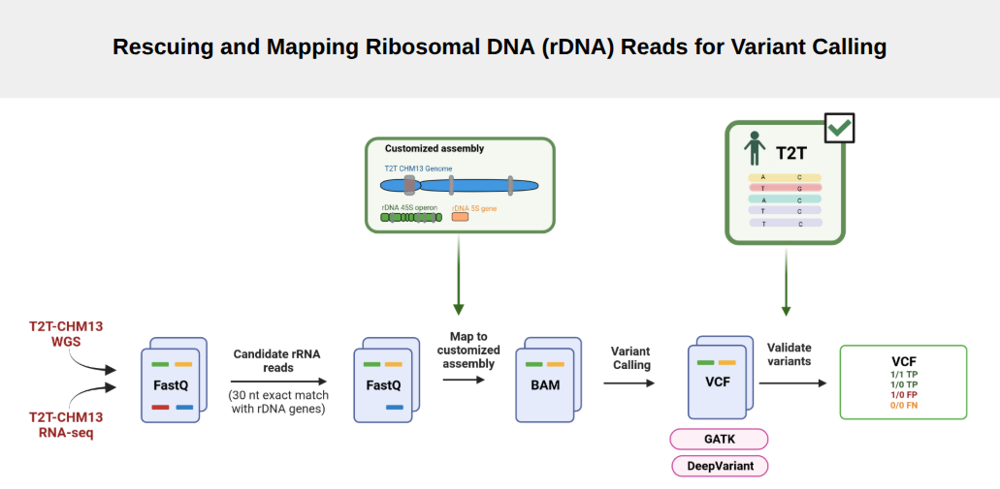

# Inter and intra individual variants in rDNA genes
TFGL-AISHA SHAH

This github repisotary includes all the scripts used in for my Bachelor Final Degree
Project (BSc. Bioinformatics, UPF-UAB-UPC-UB Joint Degree Programme).

📄 **Final Degree Project Report:**  
-  [Main Manuscript](https://drive.google.com/file/d/11ONEkx2LUCiU-mXELJjXtO7EIUWjoNWD/view?usp=sharing)
-  [Supplementary Material](https://drive.google.com/file/d/1zDHZQj9cEzbDn7AprE-f1XhMw3BrUhQ9/view?usp=sharing)
-  [Publication](https://pmc.ncbi.nlm.nih.gov/articles/PMC12714689/)

1.  **Directory Name : 00_T2T_rDNA_data**  
      
    This for directory includes :

    - rDNA consensus based on 24 unique rDNA sequences annotated in
      T2T-CHM13 human genome
    - CN of each unique sequence
    - Coordinates of unique sequences in T2T-CHM13 genome
    - Pairwise percentage identities and alignment of 24 unique
      sequences with consensus
    - Bedgraph file of GC coverage along consensus sequence
    - Variants in unique sequences
    - Blacklisted regions in rDNA 45S consensus

2.  **Directory Name : 00_T2T-CHM13_Genomic_Coordinates_for_rDNA**  
      
    This file includes scripts used to extract rDNA sequences from
    T2T-CHM13 annotation files. It also include bed files of masked
    regions in T2T-CHM13 genome to create customize reference for rDNA
    mapping.  
    `(corrsponds to section "Obtaining genomic coordinates of rDNA genes in the T2T-CHM13 human reference genome" and "Creating a suitable reference genome of rRNA variant calling" in Project_Report)`

3.  **Directory Name : 01_Identifying_T2T-CHM13_Unique_rDNA_copies**  
    This directory contains scripts to extract unique rDNA sequences
    from 219 rDNA sequences annotated in T2T-CHM13 genome.  
    (\``corresponds to section :`Characterization of the rDNA copies in
    the T2T-CHM13 human reference genome in \`\``Project_Report`)\`

4.  **Directory Name : 02_T2T-CHM13_Identifying_Pseudogenes**  
    This directory contains information and script for identification of
    rDNA-like regions in T2T-CHM13 genome to mask them in order to
    create customized assembly. (as mentioned in “2”)

5.  **Directory Name:
    03_T2T-CHM13_Gold_Standard_variants_using_kmers**  
    This directory contains scripts used to get Gold-Standard Variant
    set using simulated kmers from 219 rDNA copies annoatted in
    T2T-CHM13 genome.

6.  **Directory Name: 04_T2T-CHM13_Variant_Calling**  
    This directory contains scripts used for Variant Calling on
    T2T-CHM13 DNAseq and RNAseq Data

7.  **Directory Name: 05_LCL_Variant_Calling**  
    This directory contains information about LCL data used in this
    analysis and scripts to download it. (For variant calling scripts in
    **04_T2T-CHM13_Variant_Calling** were modified to run on 48 samples)

8.  **Directory Name: nucmer_script**  
    This directory contains script to extract candidate rDNA and rRNA
    reads from fasta or fastq files of all datasets used in this
    project.
